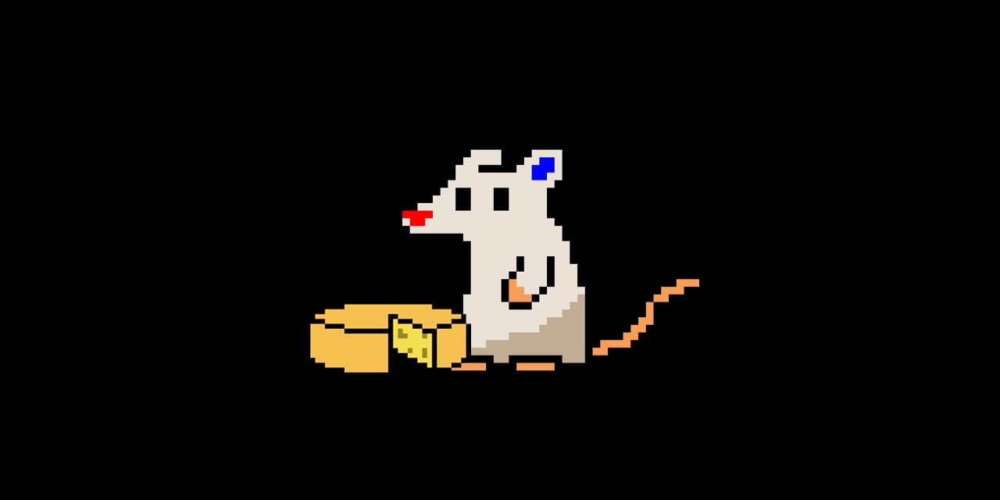

# Sir RGB Rat Cheese Simulator

## Description
Sir RGB Rat wants cheese. He demands that you give him cheese. Give as many cheeses as possible by clicking on Sir RGB Rat. How many clicks can your mouse handle before it explodes? The project is my first completed game. I have submitted as an entry in the Carleton University September 2025 Game Jam under the theme "Feed the Beast." I will only provide updates to the Windows and Linux builds to fix bugs and glitches. If you wish to develop the game for a different platform or add your own customizations, feel free to do so using the source code.
## Credits
- Code: Agent Xenial
- Sprites: [SammyCadian](https://sammycadian.itch.io)
- Audio: [James May](https://www.myinstants.com/en/instant/cheese-james-may-10207)
## Software Used
- [Audacity](https://v2-audacity.com)
- [Ghostwriter](https://ghostwriter.kde.org)
- [GoDot 4.5+](https://godotengine.org)
- [Krita](https://krita.org)